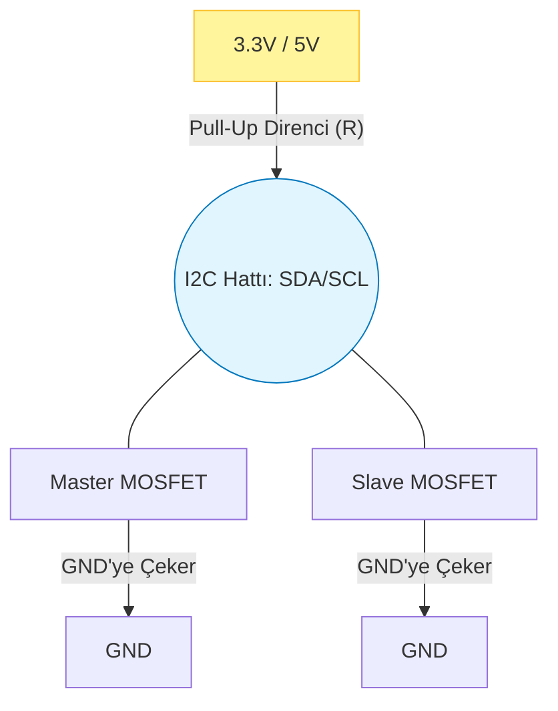
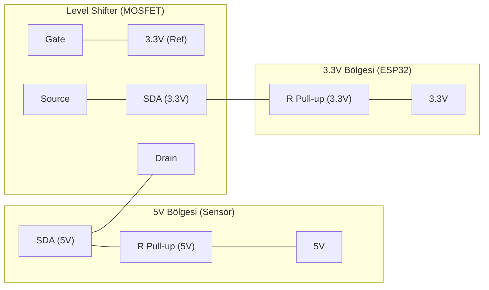

|  |  |
| :---: | :---: |

---

# 🔌 Bölüm 1: I2C Fiziksel Katmanı (The Physics)

I2C (Inter-Integrated Circuit), Philips tarafından 1982'de "kart üzerindeki çiplerin konuşması" için icat edilmiştir. 

RS485 gibi bir "Uzun Yol Kamyonu" değildir; o bir "Ofis İçi Haberleşme" sistemidir. Sahada yaşanan sorunların %90'ı, I2C'yi **olmadığı bir şey gibi (uzun mesafe kablosuyla)** kullanmaya çalışmaktan kaynaklanır.

## 1.1 Temel Yapı: Sadece 2 Tel (+ GND)

I2C, iletişim için sadece iki hatta ihtiyaç duyar:

1.  **SDA (Serial Data):** Verinin aktığı yol.
2.  **SCL (Serial Clock):** Verinin ne zaman okunacağını belirleyen saat sinyali (Master üretir).
3.  **GND:** (Unutulmamalı!) Ortak referans noktası.

---

## 1.2 "Open-Drain" Mantığı (En Kritik Konu)

I2C, diğer protokollerden (UART, SPI) çok farklı bir elektriksel yapı kullanır: **Open-Drain (veya Open-Collector).**

Bunu anlamak için **"Otobüs Durdurma Düğmesi"** veya **"İp"** analojisini kullanabiliriz:
* Hat normalde bir yay (Direnç) tarafından yukarıda (5V veya 3.3V) tutulur.
* Durmak isteyen yolcu (Master veya Slave), ipe asılarak hattı aşağı (GND) çeker.
* İpi kimse yukarı itmez; ipi bıraktığınızda yay (direnç) sayesinde kendiliğinden yukarı çıkar.

**Teknik Çıkarım:**
* Bir I2C cihazı hatta asla **Voltaj Basmaz (Source Current)**.
* Sadece hattı **Toprağa Çeker (Sink Current)** veya **Serbest Bırakır (Float)**.
* Bu sayede birden fazla cihaz aynı anda konuşmaya çalışsa bile kısa devre (Kıvılcım) olmaz. Sadece veri bozulur.

---

## 1.3 Pull-Up Dirençleri (R_pullup)

Open-Drain yapısı gereği, hat boşta iken voltajın "1" seviyesine çıkabilmesi için harici bir dirence ihtiyaç vardır.

### Direnç Seçimi Neden Önemli?
* **Çok Büyük Direnç (Örn: 100kΩ):** Hat çok yavaş yükselir ("Weak Pull-up"). Sinyal kare dalga yerine "Köpek Balığı Yüzgecine" (Shark Fin) benzer. Hızlı iletişimde (400kHz) veri hataları oluşur.
* **Çok Küçük Direnç (Örn: 1kΩ):** Hat çok hızlı yükselir ("Strong Pull-up") ama akım tüketimi artar. Cihazın MOSFET'i hattı GND'ye çekmekte zorlanabilir (Logic 0 seviyesi 0.1V yerine 0.8V'a çıkar ve okunamaz).

### Saha Reçetesi (ESP32 İçin):
| Hız (Speed) | Önerilen Direnç (3.3V) | Notlar |
| :--- | :--- | :--- |
| **Standard (100 kHz)** | **4.7kΩ** | En güvenli değerdir. |
| **Fast (400 kHz)** | **2.2kΩ** | Hızlı yükselme için daha düşük direnç gerekir. |
| **High Speed** | **1kΩ - 1.5kΩ** | Sadece kısa mesafede. |

> **⚠️ ESP32 Notu:** ESP32'nin dahili `INPUT_PULLUP` dirençleri yaklaşık 30kΩ-50kΩ civarındadır. Bu değer I2C için **yetersizdir.** Harici direnç kullanmak her zaman daha sağlıklıdır.

---

## 1.4 Kapasitans ve Kablo Mesafesi

I2C, PCB üzerinde 10-20 cm mesafe için tasarlanmıştır. Ancak biz onu sensör okumak için 2-3 metre kabloyla uzatmaya çalışırız.

**Sorun: Kablo Kapasitansı (pF)**
Her kablo aslında bir kondansatördür. Kablo uzadıkça kapasitans artar. Pull-up direnci bu kondansatörü şarj etmeye çalışır.
* **Sonuç:** Kare dalganın köşeleri yuvarlanmaya başlar.
* **Sınır:** I2C standardı maksimum **400pF** kapasitansa izin verir (Bu yaklaşık 2-3 metre CAT5 kabloya denk gelir).

**Çözüm:**
1.  **Hızı Düşürün:** 100 kHz yerine 10-20 kHz kullanın (Yazılım çözümü).
2.  **Düşük Direnç Kullanın:** 4.7k yerine 2.2k takarak hattı daha güçlü çekin.
3.  **Donanım Çözümü:** Uzun mesafe için **P82B715** (I2C Bus Extender) veya **PCA9615** (Differential I2C) kullanın. Bu çiplerle 50 metreye kadar çıkabilirsiniz.

---

## 1.5 Mantık Seviyesi (Logic Level Shifting)

ESP32 **3.3V** ile çalışır. Birçok I2C modülü (Örn: 16x2 LCD, Arduino Modülleri) ise **5V** ile çalışır.

* **Risk:** 5V ile pull-up yapılmış bir SDA hattı, ESP32'nin pinine 5V uygularsa işlemci zarar görebilir.
* **Çözüm:** **Bi-Directional Logic Level Converter** (Çift Yönlü Seviye Dönüştürücü) kullanılmalıdır. Genellikle BSS138 MOSFET ile yapılır.

---

## ✅ Özet: I2C Donanım Kontrol Listesi

Bir PCB çizerken veya breadboard kurarken şunları kontrol edin:

1.  [ ] **Pull-up Dirençleri:** SDA ve SCL hatlarında harici direnç (2.2k - 4.7k) var mı?
2.  [ ] **Voltaj Uyumu:** 5V sensörler için Level Shifter kullanıldı mı?
3.  [ ] **Kablo Boyu:** Kablolar 50cm'den uzun mu? Uzunsa hızı düşürdünüz mü veya Extender kullandınız mı?
4.  [ ] **GND:** Master ve Slave cihazların toprakları (GND) birleştirildi mi?

---

## 📚 Referanslar ve Okuma Listesi

Bu bölümdeki bilgilerin dayandığı teknik dökümanlar:

1.  **NXP UM10204:** I2C-bus specification and user manual. (I2C'nin İncil'idir).
2.  **Texas Instruments - SLVA680:** "I2C Bus Pullup Resistor Calculation". Direnç hesabının matematiğini anlatır.
3.  **Philips AN97055:** "Bi-directional level shifter for I2C-bus". 3.3V ve 5V sistemleri birbirine bağlamanın standart yöntemidir.

---

 

|  |  |  |
| :---: | :---: | :---: |
| | **Menüye Dön** | **Bölüm 2: Protokol Detayları** |

