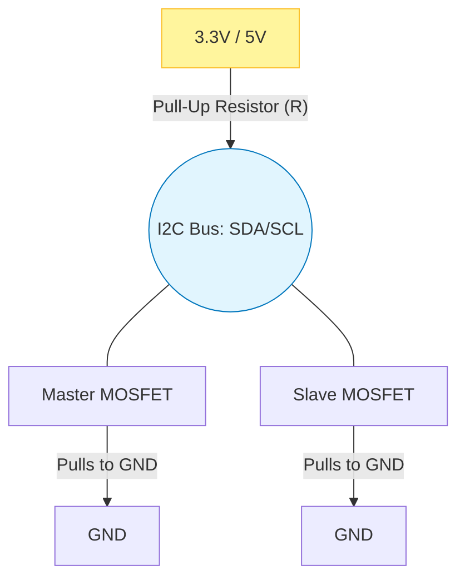
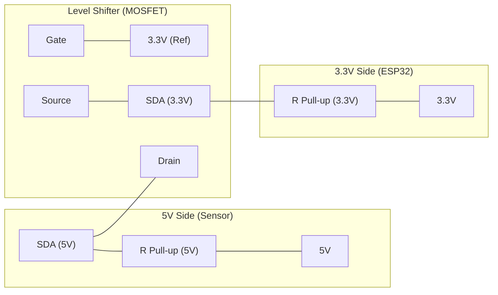

|  |  |
| :---: | :---: |

---

# 🔌 Chapter 1: I2C Physical Layer (The Physics)

I2C (Inter-Integrated Circuit) was invented by Philips in 1982 for "communication between chips on a board."

Unlike RS485, it is not a "Long Haul Truck"; it is an "Inter-Office Communication" system. 90% of field issues stem from trying to use I2C as **something it is not (e.g., with long-distance cables).**

## 1.1 Basic Structure: Just 2 Wires (+ GND)

I2C requires only two lines for communication:

1.  **SDA (Serial Data):** The path where data flows.
2.  **SCL (Serial Clock):** The clock signal that determines when to read data (Generated by Master).
3.  **GND:** (Must not be forgotten!) Common reference point.

---

## 1.2 "Open-Drain" Logic (The Most Critical Topic)

I2C uses a very different electrical structure than other protocols (UART, SPI): **Open-Drain (or Open-Collector).**

To understand this, we can use the **"Bus Stop Button"** or **"Rope"** analogy:
* The line is normally held up (at 5V or 3.3V) by a spring (Resistor).
* A passenger (Master or Slave) who wants to stop pulls the rope down (to GND).
* No one pushes the rope up; when you let go, the spring (resistor) pulls it up automatically.

**Technical Implication:**
* An I2C device never **pushes voltage (Source Current)** to the line.
* It only **pulls the line to Ground (Sink Current)** or **lets it go (Float)**.
* Thanks to this, even if multiple devices try to speak at the same time, there is no short circuit (Sparks). Only data gets corrupted.

---

## 1.3 Pull-Up Resistors (R_pullup)

Due to the Open-Drain structure, an external resistor is needed to pull the voltage up to the "1" level when the line is idle.

### Why is Resistor Selection Important?
* **Too Large (e.g., 100kΩ):** The line rises too slowly ("Weak Pull-up"). The signal looks like a "Shark Fin" instead of a square wave. Data errors occur at high speeds (400kHz).
* **Too Small (e.g., 1kΩ):** The line rises very fast ("Strong Pull-up"), but current consumption increases. The device's MOSFET may struggle to pull the line to GND (Logic 0 level rises to 0.8V instead of 0.1V and cannot be read).

### Field Recipe (For ESP32):
| Speed | Recommended Resistor (3.3V) | Notes |
| :--- | :--- | :--- |
| **Standard (100 kHz)** | **4.7kΩ** | The safest value. |
| **Fast (400 kHz)** | **2.2kΩ** | Lower resistance is needed for fast rise times. |
| **High Speed** | **1kΩ - 1.5kΩ** | Only for short distances. |

> **⚠️ ESP32 Note:** The internal `INPUT_PULLUP` resistors of the ESP32 are around 30kΩ-50kΩ. This value is **insufficient** for I2C. Using external resistors is always healthier.

---

## 1.4 Capacitance and Cable Distance

I2C is designed for distances of 10-20 cm on a PCB. However, we often try to extend it with 2-3 meter cables to read sensors.

**The Problem: Cable Capacitance (pF)**
Every cable is essentially a capacitor. As the cable gets longer, capacitance increases. The pull-up resistor tries to charge this capacitor.
* **Result:** The corners of the square wave start to round off.
* **Limit:** The I2C standard allows a maximum capacitance of **400pF** (This corresponds to approximately 2-3 meters of CAT5 cable).

**Solution:**
1.  **Lower the Speed:** Use 10-20 kHz instead of 100 kHz (Software solution).
2.  **Use Lower Resistance:** Use 2.2k instead of 4.7k to pull the line stronger.
3.  **Hardware Solution:** Use **P82B715** (I2C Bus Extender) or **PCA9615** (Differential I2C) for long distances. These chips allow you to go up to 50 meters.

---

## 1.5 Logic Level Shifting

ESP32 works with **3.3V**. Many I2C modules (e.g., 16x2 LCD, Arduino Modules) work with **5V**.

* **Risk:** If an SDA line pulled up to 5V applies 5V to the ESP32 pin, the processor may be damaged.
* **Solution:** A **Bi-Directional Logic Level Converter** must be used. Usually built with BSS138 MOSFETs.

---

## ✅ Summary: I2C Hardware Checklist

Check these when designing a PCB or setting up a breadboard:

1.  [ ] **Pull-up Resistors:** Are there external resistors (2.2k - 4.7k) on SDA and SCL lines?
2.  [ ] **Voltage Matching:** Is a Level Shifter used for 5V sensors?
3.  [ ] **Cable Length:** Are cables longer than 50cm? If so, did you lower the speed or use an Extender?
4.  [ ] **GND:** Are the grounds (GND) of Master and Slave devices connected?

---

## 📚 References & Reading List

Technical documents on which the information in this section is based:

1.  **NXP UM10204:** I2C-bus specification and user manual. (The Bible of I2C).
2.  **Texas Instruments - SLVA680:** "I2C Bus Pullup Resistor Calculation". Explains the math of resistor calculation.
3.  **Philips AN97055:** "Bi-directional level shifter for I2C-bus". The standard method for connecting 3.3V and 5V systems.

---

 

|  |  |  |
| :---: | :---: | :---: |
| | **Back to Menu** | **Chapter 2: Protocol Details** |

