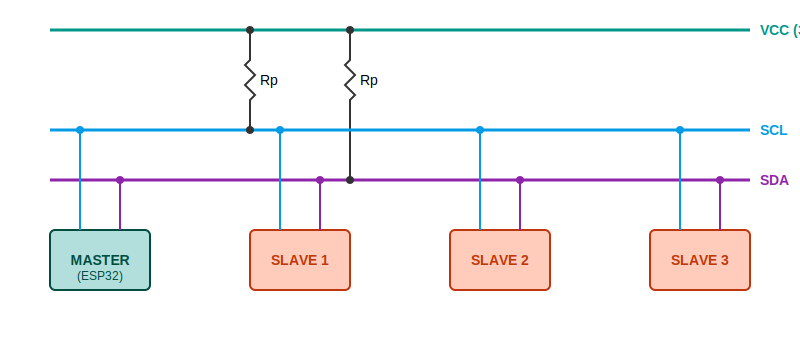
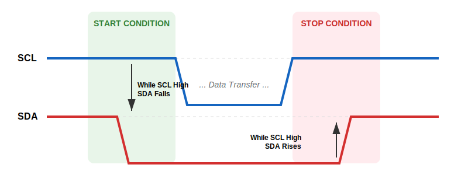

|  |  |
| :---: | :---: |

---

# 📝 Chapter 2: I2C Protocol Details

In the physical layer, we learned how to "pull and release the ropes". Now we will learn the sequence of pulling these ropes to say "Hello".

I2C uses a **Synchronous** and **Bus** topology. This means dozens of devices can be connected to a single line, provided they follow the rules.

## 2.1 I2C Topology and Connection Diagram

In the diagram below, 1 Master (ESP32) and 3 different Slaves (Sensors) are connected to the same bus. The VDD line is at the top, pulling the SDA/SCL lines up via resistors.

> **📐 Practical Pull-Up Resistor Calculation:**
> * **Minimum Resistance (Strongest Pull):** $R_{min} = \frac{V_{cc} - 0.4V}{3mA} \approx 1k\Omega$ (For 3.3V).
> * **Maximum Resistance (Low Power):** Depends on cable capacitance but usually kept below **10kΩ**.
> * **Standard Value:** Typically **4.7kΩ** or **2.2kΩ** is the safest range.

---

## 2.2 Start and Stop Conditions (Traffic Lights)

Communication begins with a specific "violation". Normally data changes when SCL is low. If SDA changes while SCL is high, it is a command.

* **START:** Pulling SDA **Low** while SCL is **High**.
* **STOP:** Releasing SDA **High** while SCL is **High**.

---

## 2.3 Data Packet and ACK/NACK (9th Bit)

Every data packet in I2C is **8 bits (1 Byte)** long. However, at the end of every 8 bits, there is a **9th bit (ACK/NACK)** duration for the receiver to say "Got it!".

1.  **Master:** Sends 8 bits of data.
2.  **Slave:** If it received the data, it pulls the SDA line **Low (ACK - Acknowledge)** during the 9th bit.
3.  **Result:** If the Master sees the line is still floating High during the 9th bit, it means no one answered (**NACK**).

---

## 2.4 Addressing and Collision Issues

Every device in I2C has a unique ID number (Address).

### A. Standard 7-Bit Addressing
* **Address Range:** 0x08 to 0x77.
* **Formula:** 7 Bit Address + 1 Bit (Read/Write).
    * If Datasheet says **0xA0** (8-bit), use **0x50** (7-bit) in code.

### B. Critical Scenario: What if Two Devices Have the Same Address? 💥
What happens if you connect two identical temperature sensors (e.g., Address 0x40) to the same line?
* **Result:** When Master shouts "0x40", both answer "Here!" (ACK) simultaneously. Data corruption occurs during transmission.
* **Solution 1 (Hardware Pin):** Change the address jumpers (A0, A1) on the sensor.
* **Solution 2 (Multiplexer):** If the address is fixed, use a multiplexer like **TCA9548A** to separate them into different channels.

---

## 2.5 How Many Devices Can Be Connected? (Bus Capacitance)

Theoretically, 112 devices can be connected. However, in practice, the limit is physical.

### Limit: Bus Capacitance ($C_{bus}$)
The I2C standard requires the total bus capacitance not to exceed **400pF**.
* Each device adds about **10pF**.
* Each meter of cable adds about **100pF**.
* **Result:** With 1 meter of cable, you can connect a maximum of **20-30 devices**. For more, you need an **I2C Buffer** (PCA9615).

---

## 2.6 Cousins of I2C: SMBus and PMBus

1.  **SMBus (System Management Bus):** For motherboards and batteries. Has a strict "Timeout" (35ms).
2.  **PMBus (Power Management Bus):** Built on SMBus for managing power supplies.

---

## 2.7 Clock Stretching (Speed Confusion) ⏳

If a slow sensor cannot keep up, it pulls the SCL line Low to say "I haven't finished measuring yet". The Master must wait for this.

> **ESP32 Solution:** Increase the timeout duration using `Wire.setTimeOut(ms)`.

---

## 2.8 I2C Speed Standards

| Mode | Speed | Notes |
| :--- | :--- | :--- |
| **Standard Mode (Sm)** | 100 kbit/s | Safest. Ideal for long cables. |
| **Fast Mode (Fm)** | 400 kbit/s | Modern standard. |
| **Fast Mode Plus (Fm+)** | 1 Mbit/s | Requires strong pull-up. |

---

## 📚 References & Reading List

1.  **NXP I2C Bus Specification:** The official standard of the I2C protocol.
2.  **TI - Understanding I2C Bus:** Detailed technical article by Texas Instruments.
3.  **SMBus Specification:** Details of the System Management Bus.

---

 

|  |  |  |
| :---: | :---: | :---: |
| **Chapter 1: Physical Layer** | **Back to Menu** | **Chapter 3: ESP32 Integration** |

