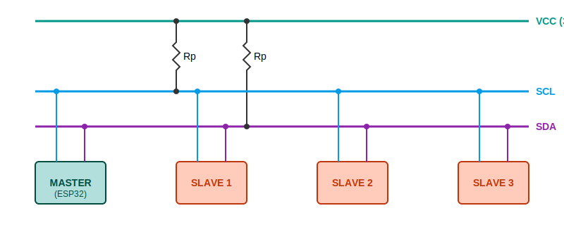
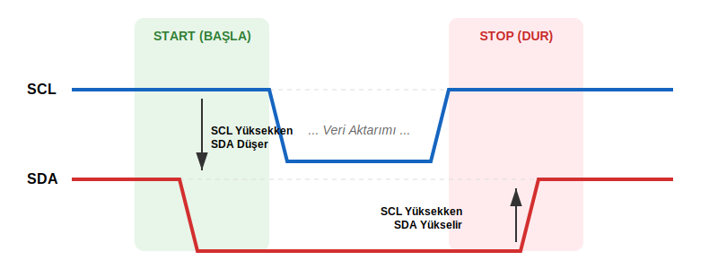

|  |  |
| :---: | :---: |

---

# 📝 Bölüm 2: I2C Protokol Detayları

Fiziksel katmanda "ipleri çekip bırakmayı" öğrendik. Şimdi bu ipleri hangi sırayla çekerek "Merhaba" diyeceğimizi öğreneceğiz.

I2C, **Senkron** ve **Bus (Veri Yolu)** topolojisine sahip bir haberleşmedir. Yani tek bir hat üzerine onlarca cihaz bağlanabilir.

## 2.1 I2C Topolojisi ve Bağlantı Şeması

Aşağıdaki şemada, 1 Master (ESP32) ve 3 farklı Slave (Sensör) aynı hatta bağlanmıştır. VDD hattı en tepededir, dirençler üzerinden SDA/SCL hatlarını yukarı çeker.

> **📐 Pratik Pull-Up Direnci Hesabı:**
> * **Minimum Direnç (Güçlü Çekim):** $R_{min} = \frac{V_{cc} - 0.4V}{3mA} \approx 1k\Omega$ (3.3V için).
> * **Maksimum Direnç (Düşük Güç):** Kablo kapasitansına bağlıdır ama genelde **10kΩ** üzerini önermeyiz.
> * **Standart Değer:** Genellikle **4.7kΩ** veya **2.2kΩ** en güvenli aralıktır.

---

## 2.2 Start ve Stop Durumları (Trafik Işıkları)

İletişim, özel bir "ihlal" ile başlar. Normalde veri değişimi SCL düşükken yapılır. Eğer SCL yüksekken SDA değişirse, bu bir komuttur.

* **START (Başla):** SCL **Yüksek** iken, SDA'nın **Aşağı** çekilmesi.
* **STOP (Dur):** SCL **Yüksek** iken, SDA'nın **Yukarı** bırakılması.

---

## 2.3 Veri Paketi ve ACK/NACK (9. Bit)

I2C'de her veri paketi **8 bit (1 Byte)** uzunluğundadır. Ancak her 8 bitin sonunda, karşı tarafın "Aldım!" demesi için **9. bir bit (ACK/NACK)** süresi vardır.

1.  **Master:** 8 bit veriyi gönderir.
2.  **Slave:** Eğer veriyi aldıysa, 9. bit süresince SDA hattını **GND'ye çeker (ACK - Acknowledge)**.
3.  **Sonuç:** Eğer Master, 9. bit'te hattın hala havada (High) olduğunu görürse, kimse cevap vermemiş demektir (**NACK**).

---

## 2.4 Adresleme ve Çakışma Sorunları

I2C'de her cihazın benzersiz bir kimlik numarası (Adres) vardır.

### A. Standart 7-Bit Adresleme
* **Adres Aralığı:** 0x08 ile 0x77 arası.
* **Formül:** 7 Bit Adres + 1 Bit (Okuma/Yazma).
    * Datasheet'te **0xA0** yazıyorsa (8-bit), kodda **0x50** (7-bit) kullanılır.

### B. Kritik Senaryo: Aynı Adresli İki Cihaz Olursa? 💥
İki adet aynı model sıcaklık sensörünü (Örn: Adres 0x40) aynı hatta bağlarsanız ne olur?
* **Sonuç:** Master "0x40" diye bağırdığında ikisi de aynı anda "Buradayım" (ACK) der. Veri hatası oluşur.
* **Çözüm 1 (Donanım Pini):** Sensör üzerindeki A0, A1 jumperlarını değiştirin.
* **Çözüm 2 (Multiplexer):** Adres değişmiyorsa, **TCA9548A** gibi bir çoklayıcı kullanın.

---

## 2.5 Bir Hatta Kaç Cihaz Bağlanabilir? (Veri Yolu Kapasitansı)

Teorik olarak 112 cihaz bağlanabilir ama pratikte sınır fizikseldir.

### Sınır: Veri Yolu Kapasitansı ($C_{bus}$)
I2C standardı maksimum **400pF** kapasitansa izin verir.
* Her cihaz yaklaşık **10pF** yük bindirir.
* Her metre kablo yaklaşık **100pF** yük bindirir.
* **Sonuç:** 1 metre kablo ile maksimum **20-30 cihaz** bağlayabilirsiniz. Fazlası için **I2C Buffer** (PCA9615) gerekir.

---

## 2.6 I2C'nin Kuzenleri: SMBus ve PMBus

1.  **SMBus (System Management Bus):** Anakartlar ve piller içindir. "Timeout" zorunluluğu vardır (35ms).
2.  **PMBus (Power Management Bus):** Güç kaynaklarını yönetmek için SMBus üzerine kuruludur.

---

## 2.7 Clock Stretching (Hız Karmaşası) ⏳

Yavaş bir sensör, "Ben daha ölçümü bitiremedim" diyerek SCL hattını zorla GND'ye çeker. Master'ın bunu beklemesi gerekir.

> **ESP32 Çözümü:** `Wire.setTimeOut(ms)` komutu ile bekleme süresini artırın.

---

## 2.8 I2C Hız Standartları

| Mod | Hız | Notlar |
| :--- | :--- | :--- |
| **Standard Mode (Sm)** | 100 kbit/s | En güvenli. |
| **Fast Mode (Fm)** | 400 kbit/s | Modern standart. |
| **Fast Mode Plus (Fm+)** | 1 Mbit/s | Güçlü pull-up gerekir. |

---

## 📚 Referanslar ve Okuma Listesi

1.  **NXP I2C Bus Specification:** I2C protokolünün resmi standardı.
2.  **TI - Understanding I2C Bus:** Texas Instruments teknik makalesi.
3.  **SMBus Specification:** System Management Bus detayları.

---

 

|  |  |  |
| :---: | :---: | :---: |
| **Bölüm 1: Fiziksel Katman** | **Menüye Dön** | **Bölüm 3: ESP32 Entegrasyon** |

