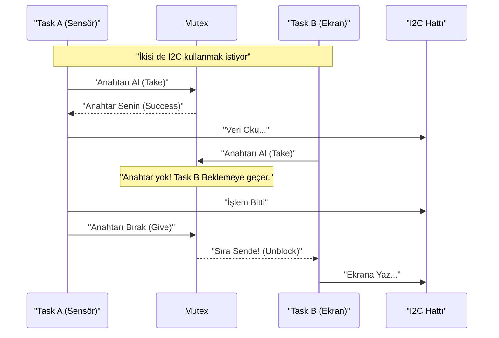

<div align="center">

| [](./README.tr.md) | [](./README.md) |
| :---: | :---: |

</div>

---

# 💻 Bölüm 3: ESP32 ve I2C Entegrasyonu

Teoride I2C basittir ama ESP32 gibi çok çekirdekli ve RTOS tabanlı bir işlemcide, "aynı anda iki görev sensör okumaya çalışırsa" işler karışır. Bu bölümde donanım soyutlama katmanını (HAL) ve güvenli kodlama tekniklerini öğreneceğiz.

---

## 3.1 Wire Kütüphanesi ve Pin Matrix (Pin Değiştirme)

Arduino dünyasında `SDA=A4`, `SCL=A5` sabittir. ESP32'de ise **GPIO Matrix** sayesinde I2C pinlerini (neredeyse) istediğiniz yere taşıyabilirsiniz.

### Temel Başlatma
```cpp
#include <Wire.h>

#define I2C_SDA 21
#define I2C_SCL 22

void setup() {
  // Wire.begin(SDA_PIN, SCL_PIN, Frequency);
  Wire.begin(I2C_SDA, I2C_SCL, 400000); // 400kHz Fast Mode
}
```

### ⚠️ Kritik Ayarlar
1.  **SetClock:** `Wire.setClock(100000);` (100kHz) veya `400000`. Uzun kablolarda 10000 (10kHz) deneyin.
2.  **SetTimeout:** `Wire.setTimeOut(50);` (ms). Yavaş sensörler (Clock Stretching) için bu süreyi uzatın, yoksa ESP32 sensörü bozuk sanıp iletişimi keser.

---

## 3.2 Çift I2C Portu Kullanımı (TwoWire)

ESP32'de **iki adet** donanımsal I2C kontrolcüsü vardır: **I2C0** ve **I2C1**. Farklı hızlarda veya farklı voltaj seviyelerindeki cihazları ayırmak için ikisini de kullanabilirsiniz.

```cpp
// İki ayrı I2C nesnesi oluştur
TwoWire I2C_1 = TwoWire(0); // Hardware Port 0
TwoWire I2C_2 = TwoWire(1); // Hardware Port 1

void setup() {
  // I2C_1: Hızlı Sensörler (400kHz) - Pin 21/22
  I2C_1.begin(21, 22, 400000);
  
  // I2C_2: Yavaş Ekran veya Uzun Kablo (100kHz) - Pin 16/17
  I2C_2.begin(16, 17, 100000);
}

void loop() {
  // Kullanırken nesne adını belirtin
  I2C_1.beginTransmission(0x50);
  I2C_2.beginTransmission(0x3C);
}
```

---

## 3.3 I2C Tarayıcı (Scanner) Kodu 🕵️‍♂️

Yeni bir sensör bağladığınızda veya "Bu cihazın adresi neydi?" dediğinizde hayat kurtaran kod budur. 0'dan 127'ye kadar tüm adresleri yoklar ve **ACK (Cevap)** gelenleri listeler.

```cpp
void i2cScanner() {
  byte error, address;
  int nDevices = 0;
  
  Serial.println("Taranıyor...");
  
  for(address = 1; address < 127; address++) {
    // Sadece "Merhaba" de ve kapat
    Wire.beginTransmission(address);
    error = Wire.endTransmission();
    
    if (error == 0) {
      Serial.print("Cihaz Bulundu: 0x");
      if (address < 16) Serial.print("0");
      Serial.println(address, HEX);
      nDevices++;
    }
  }
  
  if (nDevices == 0) Serial.println("Cihaz bulunamadı!\n");
  else Serial.println("Tarama Bitti.\n");
}
```

---

## 3.4 RTOS ile Güvenli I2C (Thread Safety & Mutex)

ESP32 çift çekirdeklidir. Eğer **Core 0** (Wi-Fi Görevi) ve **Core 1** (Sensör Görevi) aynı anda `Wire.write()` yapmaya çalışırsa veri birbirine girer ve hat kilitlenir.

Bunu engellemek için **Mutex (Mutual Exclusion - Karşılıklı Dışlama)** kullanılır. Mutex, "Tuvalet Anahtarı" gibidir. Anahtarı alan girer, işi bitince anahtarı geri asar.



### Örnek RTOS Kodu (Mutex)

```cpp
#include <FreeRTOS.h>

SemaphoreHandle_t i2cMutex;

void setup() {
  Wire.begin();
  // Mutex oluştur
  i2cMutex = xSemaphoreCreateMutex();
}

void readSensorTask(void *pvParam) {
  while(1) {
    // 1. Anahtarı almaya çalış (100ms bekle)
    if (xSemaphoreTake(i2cMutex, (TickType_t)100) == pdTRUE) {
      
      // 2. GÜVENLİ BÖLGE (Critical Section)
      Wire.requestFrom(0x50, 1);
      // ... okuma işlemleri ...
      
      // 3. Anahtarı geri bırak
      xSemaphoreGive(i2cMutex);
    } 
    else {
      Serial.println("I2C Hattı Meşgul!");
    }
    vTaskDelay(1000 / portTICK_PERIOD_MS);
  }
}
```

---

## 3.5 Sık Yapılan Entegrasyon Hataları

1.  **Yanlış Pin:** ESP32-S2/S3/C3 gibi modellerde varsayılan I2C pinleri farklıdır. Her zaman `Wire.begin(SDA, SCL)` ile pinleri elle belirtin.
2.  **Pull-up Unutmak:** `Wire.begin()` dahili pull-up'ları açar ama yetersizdir. Harici direnç şarttır.
3.  **ISR İçinde I2C:** Kesme (Interrupt) fonksiyonları içinde `Wire` kütüphanesi **kullanılamaz**. I2C yavaştır ve sistemi kilitler. ISR içinde sadece bayrak (flag) kaldırın, okumayı ana döngüde yapın.

---

## 📚 Referanslar

1.  **Arduino Wire Library:** Standart fonksiyonların dokümantasyonu.
2.  **Espressif ESP32 I2C Driver:** ESP-IDF (düşük seviye) sürücü detayları.
3.  **FreeRTOS API Reference:** Semaphore ve Mutex kullanımı.

---

<br>

<div align="center">

| [](./02-Protokol.md) | [](./README.tr.md) | [](./04-Sorun-Giderme.md) |
| :---: | :---: | :---: |
| **Bölüm 2: Protokol** | **Menüye Dön** | **Bölüm 4: Sorun Giderme** |

</div>