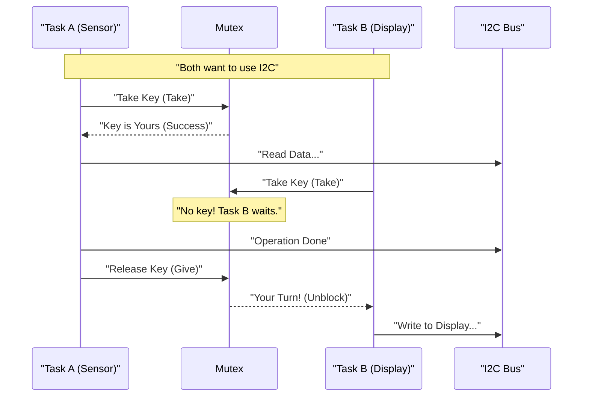

<div align="center">

| [](./README.md) | [](./03-Entegrasyon.md) |
| :---: | :---: |

</div>

---

# 💻 Chapter 3: ESP32 and I2C Integration

In theory, I2C is simple. But on a multi-core, RTOS-based processor like the ESP32, things get complicated if "two tasks try to read sensors at the same time". In this chapter, we will learn about the Hardware Abstraction Layer (HAL) and safe coding techniques.

---

## 3.1 Wire Library and Pin Matrix (Pin Remapping)

In the Arduino world, `SDA=A4` and `SCL=A5` are fixed. In ESP32, thanks to the **GPIO Matrix**, you can move I2C pins to (almost) anywhere you want.

### Basic Initialization
```cpp
#include <Wire.h>

#define I2C_SDA 21
#define I2C_SCL 22

void setup() {
  // Wire.begin(SDA_PIN, SCL_PIN, Frequency);
  Wire.begin(I2C_SDA, I2C_SCL, 400000); // 400kHz Fast Mode
}
```

### ⚠️ Critical Settings
1.  **SetClock:** `Wire.setClock(100000);` (100kHz) or `400000`. Try 10000 (10kHz) for long cables.
2.  **SetTimeout:** `Wire.setTimeOut(50);` (ms). Increase this for slow sensors (Clock Stretching), otherwise ESP32 thinks the sensor is broken and cuts communication.

---

## 3.2 Using Dual I2C Ports (TwoWire)

ESP32 has **two** hardware I2C controllers: **I2C0** and **I2C1**. You can use both to separate devices with different speeds or voltage levels.

```cpp
// Create two separate I2C objects
TwoWire I2C_1 = TwoWire(0); // Hardware Port 0
TwoWire I2C_2 = TwoWire(1); // Hardware Port 1

void setup() {
  // I2C_1: Fast Sensors (400kHz) - Pins 21/22
  I2C_1.begin(21, 22, 400000);
  
  // I2C_2: Slow Display or Long Cable (100kHz) - Pins 16/17
  I2C_2.begin(16, 17, 100000);
}

void loop() {
  // Specify the object name when using
  I2C_1.beginTransmission(0x50);
  I2C_2.beginTransmission(0x3C);
}
```

---

## 3.3 I2C Scanner Code 🕵️‍♂️

This is the life-saving code when you connect a new sensor or ask "What was the address of this device?". It probes all addresses from 0 to 127 and lists those that send an **ACK (Response)**.

```cpp
void i2cScanner() {
  byte error, address;
  int nDevices = 0;
  
  Serial.println("Scanning...");
  
  for(address = 1; address < 127; address++) {
    // Just say "Hello" and close
    Wire.beginTransmission(address);
    error = Wire.endTransmission();
    
    if (error == 0) {
      Serial.print("Device Found: 0x");
      if (address < 16) Serial.print("0");
      Serial.println(address, HEX);
      nDevices++;
    }
  }
  
  if (nDevices == 0) Serial.println("No devices found!\n");
  else Serial.println("Scan Done.\n");
}
```

---

## 3.4 Safe I2C with RTOS (Thread Safety & Mutex)

ESP32 is dual-core. If **Core 0** (Wi-Fi Task) and **Core 1** (Sensor Task) try to call `Wire.write()` at the same time, data gets corrupted and the bus locks up.

To prevent this, a **Mutex (Mutual Exclusion)** is used. A Mutex is like a "Restroom Key". Whoever gets the key enters, and hangs it back when finished.



### Example RTOS Code (Mutex)

```cpp
#include <FreeRTOS.h>

SemaphoreHandle_t i2cMutex;

void setup() {
  Wire.begin();
  // Create Mutex
  i2cMutex = xSemaphoreCreateMutex();
}

void readSensorTask(void *pvParam) {
  while(1) {
    // 1. Try to take the key (Wait 100ms)
    if (xSemaphoreTake(i2cMutex, (TickType_t)100) == pdTRUE) {
      
      // 2. SAFE ZONE (Critical Section)
      Wire.requestFrom(0x50, 1);
      // ... reading operations ...
      
      // 3. Give the key back
      xSemaphoreGive(i2cMutex);
    } 
    else {
      Serial.println("I2C Bus Busy!");
    }
    vTaskDelay(1000 / portTICK_PERIOD_MS);
  }
}
```

---

## 3.5 Common Integration Errors

1.  **Wrong Pins:** Default I2C pins are different on models like ESP32-S2/S3/C3. Always specify pins manually with `Wire.begin(SDA, SCL)`.
2.  **Forgetting Pull-ups:** `Wire.begin()` enables internal pull-ups, but they are insufficient. External resistors are mandatory.
3.  **I2C inside ISR:** You **cannot** use the `Wire` library inside Interrupt Service Routines (ISR). I2C is slow and locks the system. Only set a flag in the ISR and do the reading in the main loop.

---

## 📚 References

1.  **Arduino Wire Library:** Documentation for standard functions.
2.  **Espressif ESP32 I2C Driver:** ESP-IDF (low level) driver details.
3.  **FreeRTOS API Reference:** Usage of Semaphores and Mutexes.

---

<br>

<div align="center">

| [](./02-Protocol.md) | [](./README.md) | [](./04-Troubleshooting.md) |
| :---: | :---: | :---: |
| **Chapter 2: Protocol** | **Back to Menu** | **Chapter 4: Troubleshooting** |

</div>