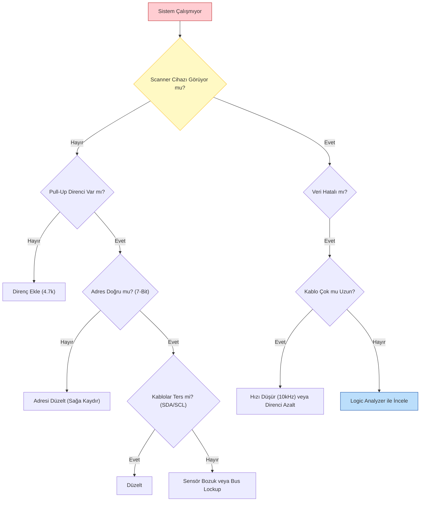

<div align="center">

| [](./README.tr.md) | [](./04-Troubleshooting.md) |
| :---: | :---: |

</div>

---

# ⚠️ Bölüm 4: I2C Sorun Giderme (Troubleshooting)

Laboratuvarda çalışan I2C hattı, sahada motorlar dönmeye başladığında veya kablo 1 metre uzadığında çöker. Bu bölüm, osiloskop ve mantık analizörü kullanarak görünmeyen sorunları bulma rehberidir.

---

## 4.1 Donanımsal Tuzaklar

### 1. Eksik Pull-Up Direnci (En Sık Yapılan Hata)
* **Belirti:** `I2C Scanner` hiçbir cihaz bulamıyor veya iletişim çok kararsız.
* **Sebep:** Dahili pull-up dirençleri (30k-50k) yetersizdir. Harici direnç takılmamıştır.
* **Test:** Hattın enerjisini kesin. SDA ile VCC arasını Ohm kademesinde ölçün. 2k - 10k arasında bir değer görmelisiniz. Sonsuz (OL) veya çok yüksekse direnç eksiktir.

### 2. Bus Lockup (Kilitlenmiş Hat) 🔒
I2C'nin en büyük kabusudur. Bir Slave cihaz (sensör), tam veri gönderirken (SDA Low) Master resetlenirse, Slave hattı bırakmaz. Master geri geldiğinde hattı "Meşgul" (Low) görür ve hiçbir şey yapamaz.

* **Çözüm (9 Clock Darbesi):** Master, açılışta (Init) SCL hattını manuel olarak 9 kez "High-Low" yaparak Slave'e "Devam et" sinyali göndermelidir. Slave, clock darbelerini görünce verisini bitirir ve hattı serbest bırakır (NACK).

```cpp
// ESP32 Bus Recovery (Kurtarma) Kodu
void recoverI2C(int sdaPin, int sclPin) {
  pinMode(sdaPin, INPUT_PULLUP); // Önce dinle
  pinMode(sclPin, OUTPUT);
  
  // 9 kez Clock darbesi gönder
  for (int i = 0; i < 9; i++) {
    digitalWrite(sclPin, HIGH);
    delayMicroseconds(5);
    digitalWrite(sclPin, LOW);
    delayMicroseconds(5);
  }
  
  // Stop Condition oluştur
  pinMode(sdaPin, OUTPUT);
  digitalWrite(sdaPin, LOW);
  digitalWrite(sclPin, HIGH);
  digitalWrite(sdaPin, HIGH);
}
```

---

## 4.2 Yazılımsal Tuzaklar

### 1. Yanlış Adres (7-Bit vs 8-Bit)
* **Belirti:** Cihaz datasheet'te var görünüyor ama `Scanner` bulamıyor (NACK alıyor).
* **Sebep:** Datasheet'te yazan 8-bit adresi (Örn: 0xA0) kullanıyorsunuz.
* **Çözüm:** Adresi bir bit sağa kaydırın (`0xA0 >> 1 = 0x50`).

### 2. EMI ve Gürültü (Spike)
* **Belirti:** Rastgele zamanlarda veri bozuluyor.
* **Sebep:** I2C kablosu motor kablolarının yanından geçiyor.
* **Çözüm:**
    * Hızı düşürün (100kHz -> 10kHz).
    * Daha güçlü pull-up direnci takın (4.7k -> 2.2k).
    * Korumalı (Shielded) kablo kullanın.

---

## 4.3 İleri Seviye Analiz: Logic Analyzer Kullanımı 🕵️‍♂️

10$'lık bir USB Logic Analyzer (Saleae Klonu) ve **PulseView** yazılımı ile hattı röntgenleyebilirsiniz.

### Ne Aramalısınız?

1.  **ACK mi NACK mi?**
    * Master adresi gönderdikten sonra 9. saat darbesinde SDA hattı aşağı iniyor mu?
    * **İniyorsa (ACK):** Cihaz adresi doğru, donanım sağlam.
    * **İnmiyorsa (NACK):** Cihaz bağlı değil, bozuk veya adresi yanlış.

2.  **Sinyal Şekli (Rise Time)**
    * Sinyal kare dalga gibi dik mi çıkıyor, yoksa "Köpek Balığı Yüzgeci" gibi yavaş mı tırmanıyor?
    * **Yavaşsa:** Kapasitans çok yüksek (uzun kablo) veya direnç çok zayıf. Direnci düşürün.

3.  **Clock Stretching**
    * SCL hattı, Master'ın bıraktığı anlardan daha uzun süre LOW kalıyorsa, Slave cihaz hattı tutuyor demektir. `setTimeout` süresini artırın.

---

## ✅ Sorun Giderme Karar Ağacı (Flowchart)



---

## ⚠️ Prototip Tuzağı: "Paralel Pull-Up" Sorunu

Bir prototip yaparken, hazır modülleri (Breakout Board) alıp breadboard üzerinde birleştiririz. Ancak üreticiler "iyilik olsun diye" her modülün üzerine pull-up direnci koyarlar.

### Senaryo:
ESP32'ye aşağıdaki modülleri bağladığınızı düşünelim:

1.  **ESP32 Dev Board:** (Bazı kartlarda 4.7k onboard direnç vardır)
2.  **MPU6050 Modülü:** Üzerinde **10kΩ** Pull-up var.
3.  **OLED Ekran:** Üzerinde **4.7kΩ** Pull-up var.
4.  **DS3231 RTC:** Üzerinde **4.7kΩ** Pull-up var.
5.  **BME280 Sensör:** Üzerinde **4.7kΩ** Pull-up var.

### Hesaplama (Paralel Direnç Kanunu):
$$\frac{1}{R_{toplam}} = \frac{1}{4700} + \frac{1}{10000} + \frac{1}{4700} + \frac{1}{4700} + \frac{1}{4700}$$

$$R_{toplam} \approx 950 \Omega$$

### Sorunlar ve Belirtiler:
1.  **Aşırı Akım:** Direnç değeri **1kΩ altına** düştü! Standart bir I2C çipi (Sensör) hattı LOW'a (0V) çekmek için en fazla **3mA** akım akıtabilir.
2.  **Logic 0 Hatası:** Sensörün gücü yetmez ve hattı 0V'a indiremez. Hat **0.6V - 0.8V** civarında asılı kalır.
3.  **Belirti:** ESP32, sensörün gönderdiği "0" sinyalini gürültü sanar veya hiç algılamaz. İletişim kopar.

### Çözüm Yolları:
* **Lehim Sökme:** Slave modüllerin üzerindeki minik SMD pull-up dirençlerini havya ile sökün. Hatta sadece **TEK BİR ÇİFT** (4.7k) direnç bırakın.
* **Multiplexer:** Dirençleri sökemiyorsanız, **TCA9548A** kullanarak modülleri elektriksel olarak birbirinden ayırın.

---

## ⚡ Pratik Saha Önerileri (Best Practices)

Teori bitti, şimdi sahadaki altın kurallar:

1.  **Dahili Pull-Up'a Güvenme:** ESP32'nin dahili dirençleri (30k-50k) çok zayıftır. Her zaman harici **2.2kΩ - 4.7kΩ** direnç kullanın.
2.  **Kablo Boyu:** I2C kart içi bir protokoldür. Kabloyu **50cm**'den kısa tutun. Uzatmak zorundaysanız hızı **10kHz**'e düşürün veya P82B715 (Extender) kullanın.
3.  **Kablo Düzeni (Crosstalk):** SDA ve SCL kablolarını birbirine dolamayın (Twisted Pair yapmayın!). Bu kapasitansı artırır. Mümkünse aralarına **GND** hattı koyarak (SDA-GND-SCL) birbirlerini etkilemelerini önleyin.
4.  **Ghost Powering (Hayalet Besleme):** Sensörün elektriği kesik ama ESP32 çalışıyorsa, akım SDA/SCL pinlerinden sensöre sızar ve sensörü "yarım yamalak" çalıştırıp bozabilir. Cihazların güçlerini eş zamanlı verin.
5.  **Watchdog & Timeout:** `Wire.setTimeOut(ms)` kullanın ve I2C işlemi donarsa sistemi resetleyecek bir **Task Watchdog Timer** kurun.
6.  **Hata Loglama:** "Çalışmıyor" demek yerine hatanın nerede olduğunu (ACK hatası mı, Timeout mu?) SD karta veya Serial porta yazdırın.
7.  **Hız Denemeleri:** Sorun varsa önce hızı düşürün. **100kHz** yerine **50kHz** veya **10kHz** deneyin.

---

## 🛠 Kullanılan Araçlar

Bu rehberdeki analizler ve çözümler için aşağıdaki araçlar kullanılmıştır:

* **Donanım:**
    * **Logic Analyzer:** Saleae Logic 8 (veya 10$'lık Klon LHT00SU1).
    * **Osiloskop:** Rigol DS1054Z (Sinyal şekli ve Rise Time incelemesi için).
    * **Multimetre:** Fluke 179 (Direnç ve Voltaj kontrolleri için).
    * **Geliştirme Kartı:** ESP32-WROOM-32 DevKit V1.
* **Yazılım:**
    * **PulseView (Sigrok):** Açık kaynaklı Logic Analyzer yazılımı.
    * **PlatformIO (VS Code):** Geliştirme ortamı.
    * **Wire.h:** Arduino standart I2C kütüphanesi.

---

## 📚 Referanslar

1.  **I2C Bus Specification (NXP):** Hata durumları ve zamanlama diyagramları.
2.  **Saleae Logic / PulseView:** Açık kaynaklı analiz yazılımı.
3.  **Texas Instruments - I2C Troubleshooting:** Uygulama notu.

---

<br>

<div align="center">

| [](./03-Entegrasyon.md) | [](./README.tr.md) |
| :---: | :---: |
| **Bölüm 3: Entegrasyon** | **Menüye Dön** |

</div>