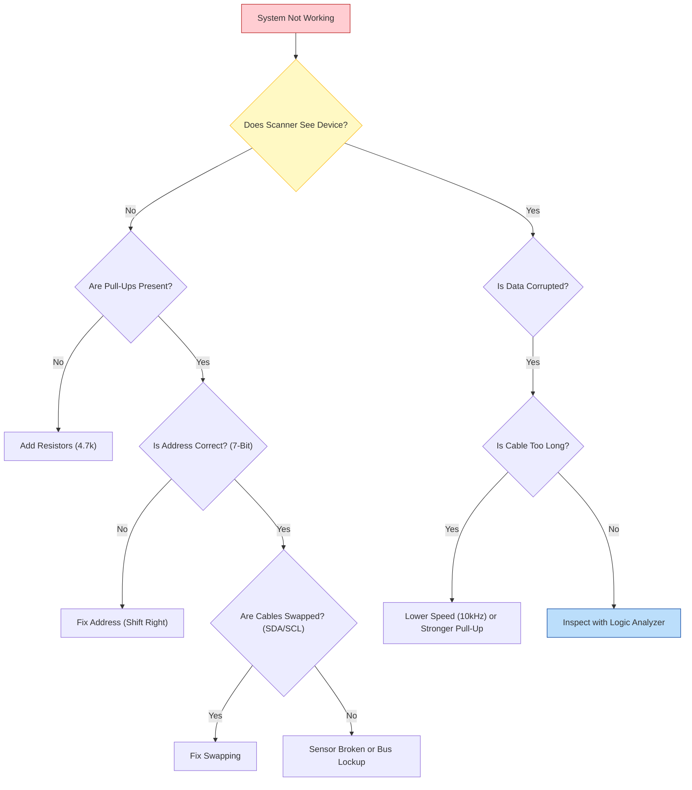

<div align="center">

| [](./README.md) | [](./04-Sorun-Giderme.md) |
| :---: | :---: |

</div>

---

# ⚠️ Chapter 4: I2C Troubleshooting

An I2C bus might work perfectly in the lab but crash in the field when motors start running or cables get extended by a meter. This chapter is a guide to hunting down invisible problems using an oscilloscope and logic analyzer.

---

## 4.1 Hardware Traps

### 1. Missing Pull-Up Resistors (Most Common Mistake)
* **Symptom:** `I2C Scanner` finds nothing or communication is very unstable.
* **Cause:** Internal pull-ups (30k-50k) are insufficient. No external resistors are installed.
* **Test:** Cut the power. Measure resistance between SDA and VCC using a multimeter. You should see a value between 2k - 10k. If it's infinite (OL) or very high, resistors are missing.

### 2. Bus Lockup (The Frozen Line) 🔒
I2C's biggest nightmare. If a Slave device is sending data (holding SDA Low) and the Master resets unexpectedly, the Slave doesn't know and keeps holding the line. When the Master wakes up, it sees the bus as "Busy" (Low) and can't do anything.

* **Solution (9 Clock Pulses):** During initialization, the Master must manually toggle the SCL line 9 times to send a "Resume" signal to the Slave. When the Slave sees the clocks, it finishes its byte and releases the line (NACK).

```cpp
// ESP32 Bus Recovery Code
void recoverI2C(int sdaPin, int sclPin) {
  pinMode(sdaPin, INPUT_PULLUP); // Listen first
  pinMode(sclPin, OUTPUT);
  
  // Send 9 Clock pulses
  for (int i = 0; i < 9; i++) {
    digitalWrite(sclPin, HIGH);
    delayMicroseconds(5);
    digitalWrite(sclPin, LOW);
    delayMicroseconds(5);
  }
  
  // Create Stop Condition
  pinMode(sdaPin, OUTPUT);
  digitalWrite(sdaPin, LOW);
  digitalWrite(sclPin, HIGH);
  digitalWrite(sdaPin, HIGH);
}
```

---

## 4.2 Software Traps

### 1. Wrong Address (7-Bit vs 8-Bit)
* **Symptom:** The device appears in the datasheet but `Scanner` can't find it (NACK).
* **Cause:** You are using the 8-bit address (e.g., 0xA0) from the datasheet.
* **Solution:** Shift the address one bit to the right (`0xA0 >> 1 = 0x50`).

### 2. EMI and Noise (Spikes)
* **Symptom:** Random data corruption.
* **Cause:** I2C cable is running alongside motor cables.
* **Solution:**
    * Lower the speed (100kHz -> 10kHz).
    * Install stronger pull-up resistors (4.7k -> 2.2k).
    * Use shielded cables.

---

## 4.3 Advanced Analysis: Using a Logic Analyzer 🕵️‍♂️

You can X-ray the line using a $10 USB Logic Analyzer (Saleae Clone) and **PulseView** software.

### What to Look For?

1.  **ACK or NACK?**
    * After the Master sends the address, does the SDA line go Low on the 9th clock pulse?
    * **Goes Low (ACK):** Device address is correct, hardware is fine.
    * **Stays High (NACK):** Device not connected, broken, or wrong address.

2.  **Signal Shape (Rise Time)**
    * Does the signal rise sharply like a square wave, or slowly like a "Shark Fin"?
    * **Slow:** Capacitance is too high (long cable) or resistors are too weak. Lower the resistance.

3.  **Clock Stretching**
    * If the SCL line stays LOW longer than the Master intends, the Slave is holding the line. Increase `setTimeout`.

---

## ✅ Troubleshooting Decision Tree (Flowchart)



---

## ⚠️ The Prototype Trap: "Parallel Pull-Up" Issue

When prototyping, we often connect multiple breakout modules together on a breadboard. However, manufacturers put pull-up resistors on each module "as a favor".

### Scenario:
Imagine connecting the following modules to an ESP32:

1.  **ESP32 Dev Board:** (Some have 4.7k onboard)
2.  **MPU6050 Module:** Has **10kΩ** Pull-up.
3.  **OLED Screen:** Has **4.7kΩ** Pull-up.
4.  **DS3231 RTC:** Has **4.7kΩ** Pull-up.
5.  **BME280 Sensor:** Has **4.7kΩ** Pull-up.

### Calculation (Parallel Resistor Law):
$$\frac{1}{R_{total}} = \frac{1}{4700} + \frac{1}{10000} + \frac{1}{4700} + \frac{1}{4700} + \frac{1}{4700}$$

$$R_{total} \approx 950 \Omega$$

### Problems and Symptoms:
1.  **Excessive Current:** Resistance dropped **below 1kΩ**! A standard I2C chip can sink max **3mA** to pull the line LOW.
2.  **Logic 0 Error:** The sensor is not strong enough to pull the line to 0V. The line floats around **0.6V - 0.8V**.
3.  **Symptom:** ESP32 interprets the "0" signal from the sensor as noise or doesn't detect it at all. Communication fails.

### Solutions:
* **Desolder:** Use a soldering iron to remove the tiny SMD pull-up resistors from the slave modules. Leave only **ONE PAIR** (4.7k) on the entire bus.
* **Multiplexer:** If you can't remove resistors, use a **TCA9548A** to electrically isolate the modules.

---

## ⚡ Best Practices & Field Tips

Theory is over, here are the golden rules of the field:

1.  **Don't Trust Internal Pull-Ups:** ESP32's internal resistors (30k-50k) are too weak. Always use external **2.2kΩ - 4.7kΩ** resistors.
2.  **Cable Length:** I2C is an on-board protocol. Keep cables shorter than **50cm**. If you must extend, lower the speed to **10kHz** or use a P82B715 (Extender).
3.  **Crosstalk & Wiring:** Do not twist SDA and SCL lines together! This increases capacitance. If possible, place a **GND** line between them (SDA-GND-SCL) to shield them from each other.
4.  **Ghost Powering:** If the sensor is unpowered but ESP32 is running, current can leak through SDA/SCL pins into the sensor, causing it to malfunction or burn. Power them up simultaneously.
5.  **Watchdog & Timeout:** Use `Wire.setTimeOut(ms)` and implement a **Task Watchdog Timer** to reset the system if I2C hangs.
6.  **Error Logging:** Instead of saying "It doesn't work", log exactly what happened (NACK error? Timeout?) to an SD card or Serial monitor.
7.  **Speed Trials:** If you face issues, lower the speed first. Try **10kHz** or **50kHz** instead of **100kHz**.

---

## 🛠 Tools Used

The following tools were used for the analyses and solutions in this guide:

* **Hardware:**
    * **Logic Analyzer:** Saleae Logic 8 (or $10 Clone LHT00SU1).
    * **Oscilloscope:** Rigol DS1054Z (For examining Signal Shape and Rise Time).
    * **Multimeter:** Fluke 179 (For Resistance and Voltage checks).
    * **Dev Board:** ESP32-WROOM-32 DevKit V1.
* **Software:**
    * **PulseView (Sigrok):** Open source Logic Analyzer software.
    * **PlatformIO (VS Code):** Development environment.
    * **Wire.h:** Standard Arduino I2C library.

---

## 📚 References

1.  **I2C Bus Specification (NXP):** Error states and timing diagrams.
2.  **Saleae Logic / PulseView:** Open source analysis software.
3.  **Texas Instruments - I2C Troubleshooting:** Application note.

---

<br>

<div align="center">

| [](./03-Integration.md) | [](./README.md) |
| :---: | :---: |
| **Chapter 3: Integration** | **Back to Menu** |

</div>