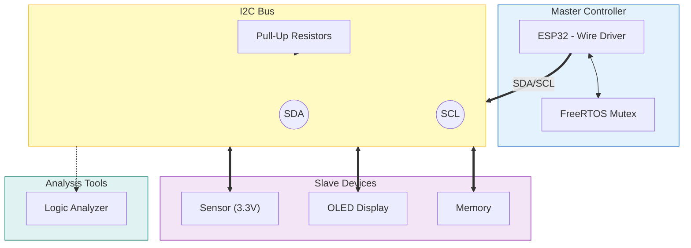

  

 

  
  
  
  

<h1 align="center">📦 Embedded I2C Communication Guide</h1>

  

  <b>A comprehensive I2C (Inter-Integrated Circuit) resource for ESP32 and Embedded Systems, blended with field experience.</b>
   
  <i>"It explains not just how to call the library, but the physics of the line and the spirit of the protocol."</i>

---

## 📖 About The Project

I2C seems like a simple protocol requiring only 2 wires (SDA/SCL). However, when deployed in the **real world**, issues like capacitance, address collisions, "Clock Stretching" by slow sensors, and Bus Lockups can turn the project into a nightmare.

This repo explains why codes working in the lab stop working in the field and provides solutions supported by **Logic Analyzer / Oscilloscope** analysis.

### 🎯 What Does It Cover?
* **Physical:** Open-Drain logic, Pull-up resistor calculation, and Cable capacitance.
* **Protocol:** Start/Stop, ACK/NACK, 7-Bit/10-Bit addressing, and Clock Stretching.
* **Software:** ESP32 `Wire` library, Pin Matrix, I2C Scanner, and RTOS (Mutex) safety.
* **Troubleshooting:** Recovering a locked bus (9-Clock), Prototype traps, and Analysis.

---

## 📚 Chapters (Contents)

This guide consists of 4 main technical chapters that complement each other:

### 🔌 [Chapter 1: Physical Layer](./01-Physical-Layer.md)
**"Should the pull-up resistor be 4.7k or 10k?"**
* Open-Drain logic (Bus button analogy).
* Resistor selection and signal shape (Square wave vs Shark fin).
* Connecting 3.3V and 5V systems (Level Shifter).
* Cable length and capacitance limit (400pF).

### 📝 [Chapter 2: Protocol Details](./02-Protocol.md)
**"Sensor datasheet says address 0xA0, but it doesn't work."**
* Start, Stop, and ACK/NACK signals.
* The 7-Bit vs 8-Bit addressing trap.
* **Clock Stretching:** Slow sensor holding the bus.
* **Collision:** How to connect two sensors with the same address? (Multiplexer).

### 💻 [Chapter 3: ESP32 Integration](./03-Integration.md)
**"Why does the I2C bus lock up when using RTOS?"**
* `Wire.h` library and Pin Matrix (Pin remapping).
* Using Dual I2C Ports (I2C0 and I2C1).
* **I2C Scanner:** Code to find who is connected to the line.
* **Thread Safety:** Preventing collisions with FreeRTOS Mutex.

### ⚠️ [Chapter 4: Troubleshooting](./04-Troubleshooting.md)
**"System locked up, won't fix without a reset!"**
* **Bus Lockup:** Code to recover the locked line with "9 Clock Pulses".
* **Parallel Resistor Trap:** How multiple modules ruin impedance.
* **Logic Analyzer:** X-raying the error with a $10 analyzer.
* **Ghost Powering:** Hidden current leaks that can burn devices.

---

## 🏗️ System Architecture

Block diagram and components of a typical embedded I2C network:

---

## 🛠 Tools & Technologies Used

* **Microcontroller:** Espressif ESP32 (DevKit V1)
* **IDE:** VS Code + PlatformIO
* **Protocol:** I2C (Standard, Fast, Fast+)
* **Hardware:** BSS138 (Level Shifter), TCA9548A (Multiplexer), USB Logic Analyzer
* **Software:** PulseView (Sigrok), Arduino Wire Library

---

---

  <i>This project is open source and open to community contributions. Feel free to send a PR!</i>

