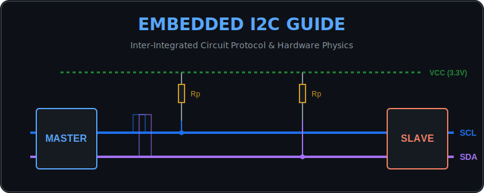
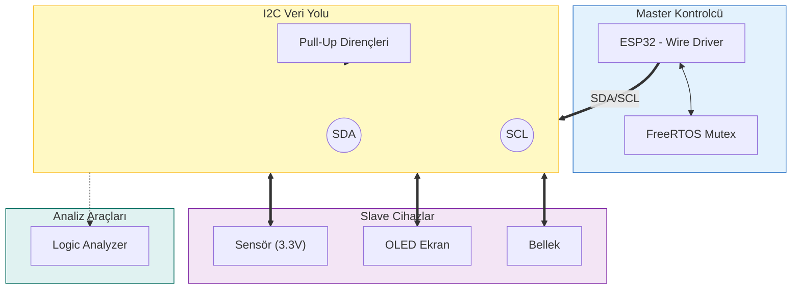

  

 

  
  
  
  

<h1 align="center">📦 Gömülü I2C Haberleşme Rehberi</h1>

  

  <b>Saha tecrübeleriyle harmanlanmış, ESP32 ve Gömülü Sistemler için kapsamlı I2C (Inter-Integrated Circuit) başvuru kaynağı.</b>
   
  <i>"Sadece kütüphane çağırmayı değil, hattın fiziğini ve protokolün ruhunu anlatır."</i>

---

## 📖 Proje Hakkında

I2C, görünürde sadece 2 tel (SDA/SCL) gerektiren basit bir protokoldür. Ancak iş **gerçek dünyaya** döküldüğünde; kapasitans sorunları, adres çakışmaları, "Clock Stretching" yapan yavaş sensörler ve kilitlenen hatlar (Bus Lockup) projeyi kabusa çevirebilir.

Bu repo, laboratuvarda çalışan kodların sahada neden durduğunu açıklar ve **Logic Analyzer / Osiloskop** destekli çözüm yolları sunar.

### 🎯 Neleri Kapsar?
* **Fiziksel:** Open-Drain yapısı, Pull-up direnci hesabı ve Kablo kapasitansı.
* **Protokol:** Start/Stop, ACK/NACK, 7-Bit/10-Bit adresleme ve Clock Stretching.
* **Yazılım:** ESP32 `Wire` kütüphanesi, Pin Matrix, I2C Scanner ve RTOS (Mutex) güvenliği.
* **Sorun Giderme:** Kilitlenen hattı kurtarma (9-Clock), Prototip tuzakları ve Analiz.

---

## 📚 Bölümler (İçindekiler)

Bu rehber, birbirini tamamlayan 4 ana teknik bölümden oluşur:

### 🔌 [Bölüm 1: Fiziksel Katman](./01-Fiziksel-Katman.md)
**"Pull-up direnci 4.7k mı olsun, 10k mı?"**
* Open-Drain mantığı (Otobüs düğmesi analojisi).
* Direnç seçimi ve sinyal şekli (Kare dalga vs Köpek balığı yüzgeci).
* 3.3V ve 5V sistemleri bağlamak (Level Shifter).
* Kablo uzunluğu ve kapasitans sınırı (400pF).

### 📝 [Bölüm 2: Protokol Detayları](./02-Protokol.md)
**"Sensör datasheet'inde adres 0xA0 yazıyor ama çalışmıyor."**
* Start, Stop ve ACK/NACK sinyalleri.
* 7-Bit vs 8-Bit adresleme tuzağı.
* **Clock Stretching:** Yavaş sensörün hattı bekletmesi.
* **Çakışma:** Aynı adrese sahip iki sensör nasıl bağlanır? (Multiplexer).

### 💻 [Bölüm 3: ESP32 Entegrasyonu](./03-Entegrasyon.md)
**"RTOS kullanırken I2C hattı neden kilitleniyor?"**
* `Wire.h` kütüphanesi ve Pin Matrix (Pin değiştirme).
* Çift I2C Portu (I2C0 ve I2C1) kullanımı.
* **I2C Scanner:** Hatta kimlerin bağlı olduğunu bulan kod.
* **Thread Safety:** FreeRTOS Mutex ile çakışmaları önleme.

### ⚠️ [Bölüm 4: Sorun Giderme (Troubleshooting)](./04-Sorun-Giderme.md)
**"Sistem kilitlendi, reset atmadan düzelmiyor!"**
* **Bus Lockup:** Kilitlenen hattı "9 Clock Darbesi" ile kurtarma kodu.
* **Paralel Direnç Tuzağı:** Çoklu modül kullanımında dirençlerin empedansı bozması.
* **Logic Analyzer:** 10$'lık analizör ile hatayı röntgenleme.
* **Ghost Powering:** Cihazları yakabilecek gizli akım kaçakları.

---

## 🏗️ Sistem Mimarisi

Tipik bir gömülü I2C ağının blok şeması ve bileşenleri:

---

## 🛠 Kullanılan Araçlar ve Teknolojiler

* **Mikrodenetleyici:** Espressif ESP32 (DevKit V1)
* **IDE:** VS Code + PlatformIO
* **Protokol:** I2C (Standard, Fast, Fast+)
* **Donanım:** BSS138 (Level Shifter), TCA9548A (Multiplexer), USB Logic Analyzer
* **Yazılım:** PulseView (Sigrok), Arduino Wire Library

---

  <i>Bu proje açık kaynaklıdır ve topluluğun katkılarına açıktır. PR göndermekten çekinmeyin!</i>

